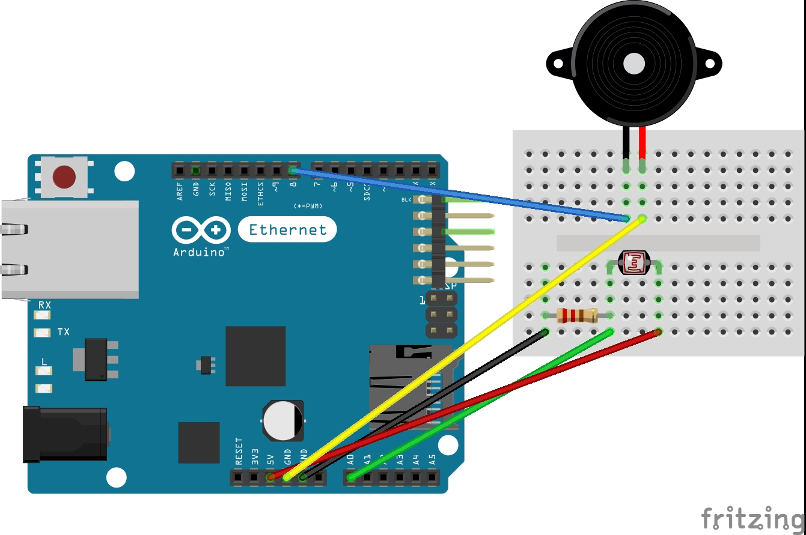

# __Alarme réfrigérateur__

Une alarme déclenchant la porte du réfrigérateur ouverte.
[@LuisRibeiro1995](https://github.com/LuisRibeiro1995)
[@OSylla92](https://github.com/OSylla92)
[@Eva]

## __Composants__

+ Arduino
+ Bread bord
+ Buzzer
+ Capteur de luminosité

## __Bibliothéque utilisée__

+ Aucune

## __Schéma__

